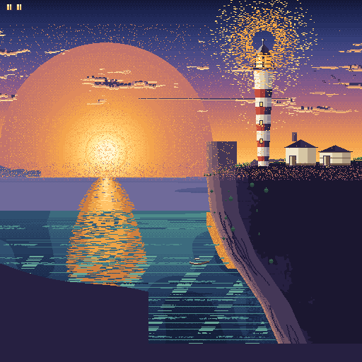

<div align="center">
  
  <h1>dotloom-mcp</h1>
  <p><strong>One pixel-art engine. Two ways to create.</strong></p>
  <p>dotloom-mcp 为人类与 AI 提供同一套像素画引擎 · Electron for humans, MCP for agents</p>
  <p>
    <a href="https://www.npmjs.com/package/dotloom-mcp"></a>
    <a href="LICENSE"></a>
    
    
  </p>
</div>

<p align="center">
  <a href="README.md">English</a> · <a href="README-ZH.md">中文</a>
</p>

<p align="center">
  
</p>

<p align="center">
  <strong>Draw in an Electron editor, command from the CLI, or let an AI agent operate the same live document.</strong><br>
  Every mutation crosses one command bus, so tools, history, exports, and undo/redo never disagree.
</p>

## Why dotloom-mcp?

<table>
  <tr>
    <td width="33%" valign="top">
      <h3>Human workspace</h3>
      <p>Pixel-perfect canvas, layers, frames, onion skinning, tilemaps, palettes, and animation playback in Electron.</p>
    </td>
    <td width="33%" valign="top">
      <h3>Agent workspace</h3>
      <p>A standalone MCP server gives agents real PNG previews, structured tools, visual quality reports, and safe batch edits.</p>
    </td>
    <td width="33%" valign="top">
      <h3>One source of truth</h3>
      <p>The Electron UI, CLI, scripts, and MCP server use the same serialisable commands and document model.</p>
    </td>
  </tr>
</table>

```text
┌─────────────────────┐
│ Electron pixel UI   │──┐
├─────────────────────┤  │
│ pixel CLI + scripts │──┼──▶  command bus  ──▶  PixelDocument
├─────────────────────┤  │        │                layers · frames
│ MCP tools/resources │──┘        │                tags · tilemaps
└─────────────────────┘           ▼
                            undo / redo history
```

## Install

`dotloom-mcp` is the canonical public package name. The internal workspace packages remain scoped as `@pixel/*`; those are implementation packages, not additional npm products.

### Requirements

- Node.js **22.13 or newer**
- npm, pnpm, or any MCP client capable of starting a local stdio server

### Install the CLI and MCP server

```bash
npm install -g dotloom-mcp
```

Verify the installation:

```bash
dotloom-mcp --version
pixel --version
```

`pixel-mcp` and `pixel-art-mcp` remain compatibility aliases for the standalone MCP server; `pixel` is the headless document CLI.

The package also exposes namespaced library APIs without starting a CLI process:

```js
import { VERSION, core, mcp, script } from 'dotloom-mcp';

const document = core.createSprite({ width: 32, height: 32 });
console.log(VERSION, document.width, typeof mcp.createPixelServer, typeof script.ScriptRuntime);
```

No global install is required for one-off use:

```bash
npx -y -p dotloom-mcp pixel --version
npx -y dotloom-mcp --version
```

### Connect an MCP client

Most desktop MCP clients use an `mcpServers` object:

```json
{
  "mcpServers": {
    "dotloom-mcp": {
      "command": "npx",
      "args": ["-y", "dotloom-mcp"]
    }
  }
}
```

On Windows, some clients require `"command": "npx.cmd"`.

<details>
<summary><strong>OpenCode V2 configuration</strong></summary>

Add the server from the project you want it available in:

```bash
opencode mcp add dotloom-mcp -- npx -y dotloom-mcp
```

Or configure it manually in `opencode.json` / `.opencode/opencode.json`:

```json
{
  "$schema": "https://opencode.ai/config.json",
  "mcp": {
    "servers": {
      "dotloom-mcp": {
        "type": "local",
        "command": ["npx", "-y", "dotloom-mcp"]
      }
    }
  }
}
```

Check the connection with `opencode mcp list` or `/mcps`.

</details>

## CLI in 30 seconds

Document operations print one JSON object, making the CLI easy to compose with shell scripts and CI; help and human-readable command listings use plain text.

```bash
# Create a layered, animated document
pixel new hero.pixel --width 32 --height 32 --layers Ink,Shade --frames 4

# Inspect, draw, and export
pixel info hero.pixel
pixel apply hero.pixel --ops ops.json
pixel export hero.pixel --out hero.png --scale 8

# Engine and game-asset formats
pixel sheet hero.pixel --out hero-sheet.png
pixel gif hero.pixel --out hero.gif --tag idle
pixel tiled hero.pixel --out hero.tmj
pixel thumb hero.pixel --out thumb.png --max 128

# Discover every command and its JSON Schema
pixel commands --json > tools.json
```

Batch operations use the same payload agents send over MCP:

```json
{
  "ops": [
    {
      "command": "draw_rect",
      "params": {
        "layer": "Ink",
        "frame": 0,
        "rect": { "x": 2, "y": 2, "w": 12, "h": 12 },
        "color": "pal:3",
        "fill": true
      }
    },
    {
      "command": "outline",
      "params": {
        "layer": "Ink",
        "color": "#101820",
        "scope": "composite"
      }
    }
  ]
}
```

Run the batch against the document:

```bash
pixel apply hero.pixel --ops ops.json
```

## What the MCP server exposes

The tool catalog is generated from the same Zod schemas used to validate commands, so documentation cannot drift from runtime behaviour.

| Capability | Why it matters |
| --- | --- |
| `get_preview` | Returns an actual PNG for one frame or all frames, optionally cropped, zoomed, layer-isolated, or onion-skinned. |
| `preview_animation` | Renders a timeline or tag-expanded playback contact sheet with sequence-aware onion skin. |
| `preview_pose` | Renders a rig pose/tween and resolves anchor and hitbox world geometry. |
| `create_sprite_spec` | Creates layers, frames, tags, palette roles and an optional rig from one declarative scaffold. |
| `preview_tilemap` | Renders an unbaked map with optional tile grid, numeric indices, invalid-cell and changed-area overlays. |
| `apply_ops` | Batches edits, supports atomic rollback, and can return a preview in the same round trip. |
| `set_frame_durations` / `upsert_tags` | Updates complete animation ranges and multiple tags in one validated command. |
| `expectedVersion` | Rejects stale writes with a version conflict instead of overwriting newer work. |
| `clip` | Keeps shading, highlights, and dither bands inside a silhouette or selected layer. |
| `add_palette_ramp` | Builds hue-shifted material ramps instead of flat interpolation. |
| `prune_palette` | Finds colours unused by all selected raw cels, with dry-run, semantic-role remapping and index mapping. |
| `ensure_palette_role` / `replace_colors` | Maintains material roles and applies one recolour across document/frame/range/list targets. |
| `quality_report` | Reports raster/landscape/tilemap quality, or character silhouette stability, palette flicker and intentional-detail exemptions. |
| `finalize_document` | Saves the editable source and renders PNG/frame/sheet/GIF/pose/contact outputs plus an optional hashed, incremental manifest. |
| `run_script` | Runs a time-limited JavaScript batch as a single undo step, with isolated dry-run and source-relative error diagnostics. |
| `load_plugin` | Registers plugin commands as live MCP tools. |

A practical agent loop is deliberately short:

```text
create_document → block silhouette → inspect PNG → shade in batches
      ↑                                                    ↓
quality_report ← fix warnings ← preview each visual gate → finalize_document
```

The standalone server runs over stdio and requires no desktop app. If the Electron app is already running, it can also attach over its loopback HTTP endpoint:

```bash
dotloom-mcp --attach http://127.0.0.1:7331/mcp
```

The attached GUI and agent then share documents and undo history: an agent edit repaints the canvas, and a human edit is immediately visible to the agent.

## Creation toolkit

- **Drawing** — pencil, eraser, line, rectangle, ellipse, polygon, bucket fill, colour replacement, clipping, and replace-style redraws.
- **Animation** — frames, bulk durations, batched tags, persistent character rigs/poses/tweens, pose and playback previews, anchors/hitboxes, onion skinning, arbitrary-angle local transforms, GIF, and spritesheets.
- **Tilemaps** — tilesets, editable grids, curved weighted terrain brushes, sparse/weighted 16/47 transitions, alpha-edge local baking, grid/index previews, map-aware diagnostics, per-tile gameplay properties, independent map objects, and self-contained Tiled `.tmj` export.
- **Pixel craft** — hue-shifted ramps, palette locking, safe unused-colour pruning, Bayer and clustered dithering, selective outlines, despeckle, and corner-aware antialiasing.
- **Landscape diagnostics** — horizon, ridge, waterline, value-plane, light-concentration, and guiding-line evidence for full-bleed scenes.
- **Scripting** — a constrained `node:vm` context with commands, pixel buffers, document inspection, sampling, timeouts, and plugins. It limits the scripting API, but is not a security boundary for untrusted code.

<details>
<summary><strong>Scripting API</strong></summary>

```js
const base = layers()[0].id;

draw.rect({
  layer: base,
  frame: 0,
  rect: { x: 0, y: 0, w: 8, h: 8 },
  color: 'pal:3',
  fill: true,
});

putPixels({ x: 8, y: 0, w: 2, h: 1 }, '/wAA/wD/AIA=');
const reflected = sampleComposite(1, 1);

log('done', commands().length);
return { base, reflected };
```

Map scripts can call `strokeTilemap(...)`, `paintTilemap(...)`, and the matching `draw.tilemap` / `draw.bake` aliases; `tilemaps()`, `mapObjects()` and `tileProperties()` read map metadata without copying large tile arrays. A whole script is one undo step. The sandbox has no `require`, `process`, filesystem, network, `eval`, or `new Function`.

</details>

## File support

| Format | Read | Write | Notes |
| --- | :---: | :---: | --- |
| `.pixel` | ✓ | ✓ | Native editable document format |
| PNG | ✓ | ✓ | Single image, all frames, arbitrary integer scale |
| Aseprite `.ase` | ✓ | — | Import into a new editable document |
| Spritesheet + JSON | — | ✓ | Aseprite-compatible `frameTags` |
| Animated GIF | — | ✓ | Tag direction and repeat are honoured |
| Tiled `.tmj` | — | ✓ | Self-contained map + tileset PNG, tile properties and object layer |

## Showcase

<table>
  <tr>
    <td width="50%"></td>
    <td width="50%"></td>
  </tr>
  <tr>
    <td align="center"><sub>Autumn Dusk Lake</sub></td>
    <td align="center"><sub>Moonlit Alpine Lake</sub></td>
  </tr>
</table>

<table>
  <tr>
    <td width="50%"><br><sub>Raster reference</sub></td>
    <td width="50%"><br><sub>Native pixel-art output</sub></td>
  </tr>
</table>

## Architecture

| Package | Role |
| --- | --- |
| `dotloom-mcp` | Published npm package: bundled library, CLI, and standalone MCP server. |
| `packages/core` | Platform-free TypeScript document model, command bus, rasteriser, PNG, GIF, and serialisation. |
| `packages/script` | Node-only JavaScript sandbox and plugin runtime. |
| `packages/cli` | JSON-first headless command line. |
| `packages/mcp` | MCP tools, resources, prompts, stdio server, and HTTP bridge. |
| `packages/app` | Electron + React + Vite editor with an embedded MCP host. |

`core` has no DOM, Electron, or Node dependency. The same source runs in Node, a browser, a worker, the Electron renderer, tests, and CI.

## Development

```bash
corepack enable
pnpm install --frozen-lockfile

pnpm build
pnpm typecheck
pnpm test

# Electron editor
pnpm --filter @pixel/app run dev

# Standalone tools from this checkout
node packages/cli/dist/index.js --help
node packages/mcp/dist/cli.js --help
```

Build the public npm bundle without publishing it:

```bash
pnpm build:npm
npm pack --dry-run
```

The repository uses pnpm workspaces, strict TypeScript, Vitest, and a clean-build CI gate. The public package bundles the internal workspace code while keeping normal npm dependencies external.

> **Distribution scope:** `dotloom-mcp@0.2.0` publishes the CLI, library entry, and standalone MCP server. The Electron application remains a source-based application in this release; desktop installers are not part of the npm tarball.

## Security and local trust

- The standalone MCP server uses stdio and is controlled by the local MCP client.
- The Electron HTTP host binds to `127.0.0.1`; it is intended for trusted local clients. Do not expose or port-forward it.
- MCP tools can read, write, import, and export local file paths. Run the server as an OS user with only the permissions you intend to grant.
- The plugin JavaScript sandbox is intentionally narrow, but MCP tools themselves are not a substitute for operating-system permissions.

## Documentation

- [Technical reference](docs/REFERENCE.md) — command catalogue, MCP internals, scripting, animation, tilemaps, and design decisions
- [Changelog](CHANGELOG.md) — release history and scope
- [Model Context Protocol](https://modelcontextprotocol.io/)
- [OpenCode MCP configuration](https://opencode.ai/v2/docs/mcp-servers/)

## Project status

`dotloom-mcp@0.2.0` is the current installable CLI/MCP release.

- [x] Core document model, rasteriser, command bus, history, and native serialisation
- [x] PNG, spritesheet, GIF, Aseprite import, and Tiled export
- [x] Electron editor, animation, palettes, onion skinning, and tilemaps
- [x] Standalone MCP server, visual resources, prompts, diagnostics, and scripts/plugins
- [x] Public npm package and CI quality gates
- [ ] Signed cross-platform Electron installers

## License

Copyright © 2026 Lonely-bear. Released under the [Apache License 2.0](LICENSE).
