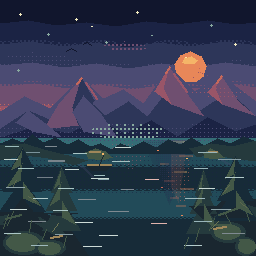
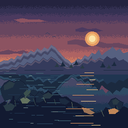
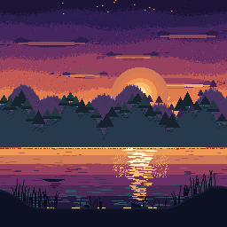
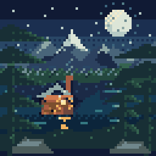
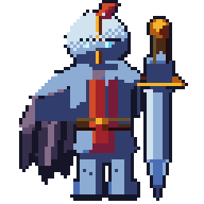
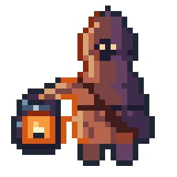

<div align="center">
  
  <h1>dotloom-mcp</h1>
  <p><strong>Make game-ready pixel art by hand, by script, or by asking an AI agent to draw it.</strong></p>
  <p>One engine, one document model, three clients: an Electron editor, a <code>pixel</code> CLI, and a Model Context Protocol server.</p>
  <p>
    <a href="https://www.npmjs.com/package/dotloom-mcp"></a>
    <a href="https://github.com/Lonely-bear/pixel-art/stargazers"></a>
    
    <a href="LICENSE"></a>
    
  </p>
</div>

<p align="center">
  <a href="README.md">English</a> · <a href="README-ZH.md">中文</a>
</p>

## What this is

You describe a sprite — "a 32×32 knight with a cape, two idle frames, twelve colours" — and it
becomes a real game asset: a palette you can index, layer names, frame tags, hitboxes, a
`.pixel` source you can commit, and PNG, spritesheet, GIF or Tiled output. You can do that in an
editor, from a shell script, or by telling an AI agent to do it. All three drive the same
commands over the same document, so undo, history, exports and the editor window never disagree.
It is a game-asset pipeline rather than an image generator: a pixel asset is a quantised,
grid-exact artefact with a technical contract, and the commands, file formats and exports are
built around that contract rather than around the picture.

It also tells you what is wrong with a drawing. Not how good it is — there is no score, no grade
and no number anywhere in this product, deliberately — but the specific, located defects a
reviewer would name: a 2×3 hole at (11, 18) that should be solid, a contour that is 4px deep on
one side and 2px on another, 43 pixels that agree with nothing around them. And when a dimension
cannot be measured, it says so and says why, instead of quietly scoring well.

## Gallery

Eight pieces from [`showcase/`](showcase/), every one drawn through the advertised MCP tool
surface only — no library import, no direct editor access. The captions are what the pipeline
reported about each one; a piece with zero issues is in this table on purpose.

<table>
  <tr>
    <td width="50%" align="center"><br><sub><b>Sunset Lighthouse 512</b> — 512×512, 10 layers, 1 named issue</sub></td>
    <td width="50%" align="center"><br><sub><b>Dusk Lake Valley Agent</b> — 256×256, 3 issues, one of them called the most likely false positive in the pipeline</sub></td>
  </tr>
  <tr>
    <td width="50%" align="center"><br><sub><b>Dusk Lake Valley Agent2</b> — the same scene drawn clean. A negative control: <b>0 issues</b>, which is what proves the others are real</sub></td>
    <td width="50%" align="center"><br><sub><b>Dusk Lake Valley V3</b> — third pass, back down to four layers; one advisory left, and it is advisory by design</sub></td>
  </tr>
  <tr>
    <td width="50%" align="center"><br><sub><b>Moonlit Alpine Lake</b> — 64×64, 3 issues including 43 stray pixels</sub></td>
    <td width="50%" align="center"><br><sub><b>Moonlit Alpine Lake Fast</b> — the same job at the same size fires <code>hue-sprawl</code> where the larger one does not: a standing gap the report names rather than a defect in the drawing</sub></td>
  </tr>
  <tr>
    <td width="50%" align="center"><br><sub><b>Ironhold Knight</b> — 64×64 armoured hero, cape and greatsword, 5 issues each located to a region</sub></td>
    <td width="50%" align="center"><br><sub><b>Lantern Keeper</b> — 32×32, 6 issues. Drawn by an agent that started with no drawing commands at all and found them through <code>list_commands</code></sub></td>
  </tr>
</table>

The remaining four renders, the per-issue reports and the reproduction recipe for each piece are
in [`showcase/gallery/gallery.json`](showcase/gallery/gallery.json) and
[`showcase/`](showcase/).

## Install

Requires **Node.js 22.13 or newer** for the npm packages. The desktop app needs nothing but the
operating system.

**Desktop app** — installers for Windows, macOS and Linux on
[GitHub Releases](https://github.com/Lonely-bear/pixel-art/releases/latest), including a
portable Windows build that needs no install. The MCP server is built into the same binary, so
an npm-installed server finds a running editor and edits the same documents. The builds are not
yet code-signed: macOS requires right-click → Open on first launch, Windows SmartScreen warns
once.

**CLI and MCP server** — one package, four bin names (`dotloom-mcp`, `pixel`, and the
`pixel-mcp` / `pixel-art-mcp` compatibility aliases):

```bash
npm install -g dotloom-mcp     # or, as a build-time dependency:
npm install -D dotloom-mcp

dotloom-mcp --version
pixel --version
```

No global install is needed for a one-off:

```bash
npx -y dotloom-mcp --version
npx -y dotloom-mcp pixel --version
```

**MCP client** — add one server block. macOS and Linux:

```json
{
  "mcpServers": {
    "dotloom-mcp": {
      "command": "npx",
      "args": ["-y", "dotloom-mcp"]
    }
  }
}
```

On Windows swap the first two fields — `npx` is not an executable Windows can launch without a
shell, and Node refuses to run `.cmd` shims directly, so the launch has to go through `cmd.exe`:

```json
{
  "mcpServers": {
    "dotloom-mcp": {
      "command": "cmd",
      "args": ["/c", "npx", "-y", "dotloom-mcp"]
    }
  }
}
```

Exact file paths for Claude Desktop, Claude Code, Cursor, Windsurf and OpenCode — which uses
`mcp` rather than `mcpServers` — and a three-step check that tells "connected" apart from
"connected and running in memory" are in [`docs/CLIENTS.md`](docs/CLIENTS.md)
([中文](docs/CLIENTS-ZH.md)).

## What it does

**Draw and edit.** Pixel-perfect canvas, layers, frames, onion skinning, palettes and animation
playback in the editor. Pencil, line, rectangle, ellipse, polygon, bucket fill, colour
replacement, clipping, hue-shifted palette ramps, Bayer and clustered dithering, selective
outlines, despeckle and corner-aware antialias.

**Animate.** Frames, bulk durations, batched tags, GIF and spritesheet export. Persistent
character rigs — parts, poses, tweens, anchors, hitboxes — with pose and playback previews, and
eight-direction characters built from one drawing.

**Build tile maps.** Tilesets, editable grids, curved weighted terrain brushes, sparse and
weighted 16/47 transitions, alpha-edge local baking, per-tile gameplay properties, map objects,
and self-contained Tiled `.tmj` export.

**See what you have actually drawn.** `read_grid` returns the artwork as a character grid —
silhouette, luminance, palette slot or colour name — so it is exact, diffable and cheap, and a
repeated call reports which rows changed. `get_preview` returns a real PNG, croppable, zoomable,
layer-isolated and onion-skinned. One verifies, one approves; that split is deliberate, because a
downsampled PNG cannot tell you whether row 14 is one step off row 13.

**Get told what is wrong, not how good it is.** `evaluate` names specific, located defects with a
code, a region and the repair — or reports nothing. A dimension that cannot be measured is
reported as unmeasured, with the reason, and never counted at its best. There is no aggregate
score, and there is not going to be one: a quality number handed to a model becomes the target
instead of the artwork, so a `quality_report` tool shipped once and was deleted.

**Read and write real formats.** `.pixel` (a plain zip: a JSON manifest and one PNG per cel, with
entry timestamps pinned, so the same document serialises to the same bytes), PNG, Aseprite
`.ase` import, spritesheet plus Aseprite-compatible JSON, animated GIF, Tiled `.tmj`.

**Automate.** A JSON-first CLI, batched ops that are the same payload the MCP server takes, and a
constrained `node:vm` scripting sandbox where a whole script is one undo step. `list_commands`
prints the entire command catalogue with its JSON Schema, so a client can discover everything
without a document.

## Use it

The shortest path to a visible PNG — no input file, no palette, no arguments:

```console
$ npx -y dotloom-mcp pixel demo --out out --size 8
pixel demo -> /…/out/crowned-slime.png
  editable source: /…/out/crowned-slime.pixel
{
  "ok": true,
  "command": "demo",
  "sprite": "Crowned Slime",
  "path": "/…/out/crowned-slime.png",
  "source": "/…/out/crowned-slime.pixel",
  "width": 256,
  "height": 256,
  "canvas": { "width": 32, "height": 32 },
  "scale": 8,
  "palette": 10,
  "layers": ["Base", "Shade", "Light", "Crown", "Face", "Outline"],
  "frames": 2,
  "tags": ["idle"],
  "commands": 33,
  "bytes": 4675
}
```

A finished 32×32 sprite — ten colours, six layers, two frames on an `idle` tag, drawn by 33
commands — upscaled 8× with nearest-neighbour sampling, next to a `.pixel` you can open in the
editor. That transcript is this repository's build, unedited. Every document operation prints
exactly one JSON object, so it composes with a shell script like any other.

`pixel new` creates a document, `pixel apply --ops ops.json` runs a batch, and `pixel export`,
`pixel sheet`, `pixel gif`, `pixel tiled` and `pixel thumb` write the output formats. Run
`pixel --help` for the whole list.

**As an agent**, the server is the tool list your client already knows how to read. `tools/list`
returns **38 entry-point tools** over stdio — measured, and a budgeted ceiling the test suite
guards, not a promise. The command catalogue behind them (101 commands: `draw_ellipse`,
`add_palette_ramp`, `outline`, `stroke_tilemap`, `autotile`, the rig, the tilemaps) is not in
that list up front; an agent finds it through `list_commands`, `describe_command`,
`find_workflow` or `apply_ops`, and a command becomes a directly callable tool the moment the
session touches it. The tool list and its parameters are rebuilt every session — read the schema
you were handed rather than one copied from a document.

Started with no arguments the server looks for a running editor on the loopback interface and
forwards to it, so the agent and the window share documents and one undo history; with no editor
it serves the same engine from memory and reconnects if one appears later.

```bash
dotloom-mcp                                        # prefer the app, keep looking
dotloom-mcp --attach http://127.0.0.1:7331/mcp     # pin one endpoint, fail loudly
dotloom-mcp --standalone                           # skip discovery entirely
```

## Integrate it

Three ways in, in increasing order of commitment.

**The library.** Take it as a `devDependency` and generate assets from a build script — no GUI,
no MCP client, no human in the loop. Nine exports are stable and covered by `API_VERSION`;
everything else is not. The API returns bytes and never touches the disk, so where they go is
your build script's business, and the same seed gives the same bytes every run.

```js
import { buildSprite, exportAssets } from 'dotloom-mcp';

const slime = buildSprite({
  seed: 20260927, width: 16, height: 16, name: 'slime',
  layers: ['base', 'shade'],
  palette: ['#0f380f', '#306230', '#8bac0f', '#9bbc0f'],
  ops: [{ command: 'draw_ellipse', params: { rect: { x: 2, y: 5, w: 12, h: 9 }, color: '#8bac0f' } }],
});

for (const file of exportAssets(slime, { sheet: true, source: true })) {
  console.log(file.path, file.bytes.length, file.mediaType);
}
```

Types ship with the package, so a mistyped call is a compile error. What is stable, what is
internal and what a major version may break is written down in
[`docs/STABILITY.md`](docs/STABILITY.md); the functions are in [`docs/API.md`](docs/API.md)
([中文](docs/API-ZH.md)), with five runnable, byte-compared examples in
[`docs/COOKBOOK.md`](docs/COOKBOOK.md) ([中文](docs/COOKBOOK-ZH.md)) and the real files in
[`cookbook/`](cookbook/).

**The asset contract.** An export target is a renderer over one contract: the engine files plus
a `meta.json` a validator can check and another tool can read. Godot, Unity, Phaser and
Excalidraw importers ship against it. [`docs/ASSET-CONTRACT.md`](docs/ASSET-CONTRACT.md)
([中文](docs/ASSET-CONTRACT-ZH.md)) is the contract;
[`docs/IMPORTERS.md`](docs/IMPORTERS.md) is the four import paths.

**CI.** A build script that only runs on your laptop is a build nobody reviews. The Action runs
it on a pull request and fails the job when the assets are wrong — a broken op, a
byte-reproducibility check, or, opt-in, a blocking named defect. It reports named defects and
never a number, because a CI log that prints a score turns the score into the target.

```yaml
- uses: dotloom-mcp/build-assets@v1.0.0
  with:
    command: node tools/build-assets.mjs
    check-command: node tools/check-assets.mjs
    quality-gate: blocking
```

[`docs/ACTION.md`](docs/ACTION.md) ([中文](docs/ACTION-ZH.md)) has every input, what will bite
on your first run, and what to do when a document is refused.

## Documentation

Start at [`docs/README.md`](docs/README.md), which indexes all of it.

| If you are… | Read |
| --- | --- |
| integrating a game engine, and want to know what you may depend on | [`STABILITY.md`](docs/STABILITY.md), then [`API.md`](docs/API.md) |
| writing a build script against the npm package | [`API.md`](docs/API.md), then [`COOKBOOK.md`](docs/COOKBOOK.md) |
| emitting or consuming exported assets | [`ASSET-CONTRACT.md`](docs/ASSET-CONTRACT.md) |
| getting artwork in from another tool | [`IMPORTERS.md`](docs/IMPORTERS.md) |
| setting up an MCP client | [`CLIENTS.md`](docs/CLIENTS.md) |
| sharing a bundle or a review | [`ACTION.md`](docs/ACTION.md), [`SHARING.md`](docs/SHARING.md) |
| looking up a command, a script or the tilemap model | [`REFERENCE.md`](docs/REFERENCE.md) |
| curious how the pipeline decides | [`dev/EVALUATION.md`](dev/EVALUATION.md) |

Contributor and agent material — repository layout, the build-serialisation rule, how to accept
work, and the locked product decisions — lives in [`AGENTS.md`](AGENTS.md) and
[`dev/`](dev/). Changelog: [`CHANGELOG.md`](CHANGELOG.md) ([中文](CHANGELOG-ZH.md)).

## Local trust

The standalone MCP server speaks stdio and is controlled by your MCP client. The Electron HTTP
host binds `127.0.0.1` and is for trusted local clients — do not expose or port-forward it. MCP
tools can read, write, import and export local file paths, so run the server as an OS user with
only the permissions you intend to grant. The JavaScript sandbox for scripts and plugins is
deliberately narrow, but it is not a security boundary for untrusted code.

## Stars

[](https://star-history.com/#Lonely-bear/pixel-art&Date)

## License

Copyright © 2026 Lonely-bear. Released under the [Apache License 2.0](LICENSE).
